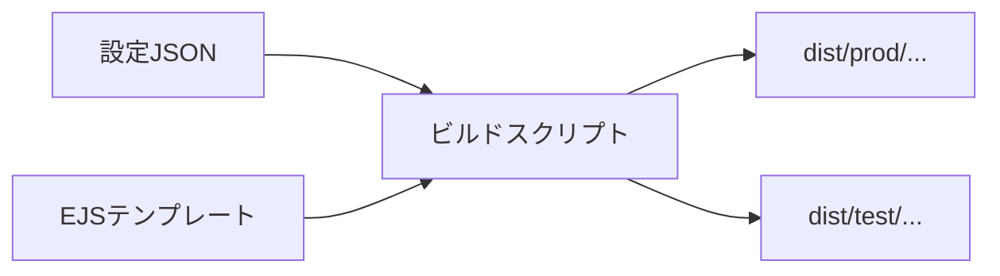

# LP計測タグ変数化による複製削減 実装計画書

## 📝 現状調査結果

### フォルダ構成
```
L-management-system/LP/
├── chikudenchi-eco.com/    # 蓄電池LP（44項目）
├── l-mmto/                  # メイン系LP（358項目）
├── lp-thanks/               # サンクスページ（180項目）
├── マンガLP_マスハタ様/      # 代理店別マンガLP
├── マンガLP_ミークリエイト様/ # 代理店別マンガLP（14項目）
├── マンガP_sirococo様/      # 代理店別マンガLP（224項目）
├── 東京都補助金LP/          # 補助金LP（572項目）
└── 直フォーム/              # フォーム（164項目）
```

### 階層構造
**パターン**: `LP種類 / 地域 / 代理店 / パターン`
```
例：東京都補助金LP / 東京 / A8 / lpa1 / index.html
```

### 複製数の概算
| 項目 | 数 |
|------|-----|
| LP種類 | 8種類 |
| 地域 | 2種類（東京/地方） |
| 代理店 | 3社（A8、ONE、ロンバード） |
| HTMLファイル総数 | 85件（検出分） |

### 計測タグの差分パターン

| タグ種類 | 差分内容 |
|---------|---------|
| Meta Pixel | IDのみ異なる（A8: `1084061196949406`, ONE: `1494083678271836`） |
| Google Ads | 代理店によって有無が異なる（ONEのみ） |
| Yahoo広告 | ONEのみ使用 |
| Crossees | ロンバードのみ使用 |
| formrun | フォームIDとパラメータが代理店ごとに異なる |
| GTM | サンクスページで使用（`GTM-P85D7GZT`等） |

---

## 🔧 設計方針

### 推奨案：ビルド時生成方式



| 観点 | 評価 |
|------|------|
| 運用負荷 | ⭐⭐⭐⭐⭐ 設定ファイルに追記するだけ |
| ミス耐性 | ⭐⭐⭐⭐⭐ タグは設定から自動挿入 |
| 計測確実性 | ⭐⭐⭐⭐⭐ 生成時に確定、ブレない |
| デバッグ | ⭐⭐⭐⭐ テスト用ビルド分離が容易 |

---

## 📁 CI/CD対応ディレクトリ構成

```
L-management-system/LP/
├── config/                     # 設定ファイル
│   ├── agencies.json           # 代理店別計測タグ設定
│   ├── regions.json            # 地域別設定
│   └── lp-types.json           # LP種類定義
│
├── src/                        # ソースファイル
│   ├── templates/              # EJSテンプレート
│   │   ├── partials/           # 共通パーツ
│   │   │   ├── head-tags.ejs   # 計測タグ（head用）
│   │   │   ├── body-tags.ejs   # GTM noscript等
│   │   │   └── form.ejs        # formrun埋め込み
│   │   └── pages/              # LP種類別テンプレート
│   │       └── tokyo-subsidy/
│   │           ├── index.ejs
│   │           └── thanks.ejs
│   └── assets/                 # 静的資産
│       └── tokyo-subsidy/
│           ├── css/
│           └── img/
│
├── scripts/                    # ビルドスクリプト
│   └── build.js
│
├── dist/                       # 生成物（Git管理外）
│   ├── prod/                   # 本番用
│   │   └── {lp-type}/{region}/{agency}/
│   └── test/                   # テスト用（計測無効）
│
├── .github/workflows/
│   └── lp-build.yml            # GitHub Actions
│
├── package.json
├── .env.example
└── .gitignore
```

---

## 🔄 CI/CD ワークフロー

### ブランチ戦略

| ブランチ | トリガー | ビルド環境 | デプロイ先 |
|---------|---------|-----------|-----------|
| `main` | push | production | 本番サーバー |
| `develop` | push | test | ステージング |
| PR | open/sync | 両方 | デプロイなし（検証のみ） |

### npm scripts

```bash
# 全LP生成（prod + test）
npm run build

# 本番用のみ
npm run build:prod

# テスト用のみ
npm run build:test

# 特定LPのみ
npm run build -- --lp tokyo-subsidy

# 特定代理店のみ
npm run build -- --agency A8

# 組み合わせ
npm run build -- --lp tokyo-subsidy --agency A8
```

---

## 🧪 テストLP計測汚染防止策

テスト環境（`dist/test/`）では以下が自動適用されます：

1. **noindex設定**: `<meta name="robots" content="noindex, nofollow">`
2. **計測タグ無効化**: 全てのトラッキングスクリプトを出力しない
3. **ダミーID**: 万一出力されても`TEST_MODE_DISABLED`を設定

---

## ✅ 作成済みファイル一覧

| ファイル | 説明 |
|---------|------|
| `package.json` | 依存関係・npm scripts定義 |
| `config/agencies.json` | 代理店別計測タグ設定 |
| `config/regions.json` | 地域別設定 |
| `config/lp-types.json` | LP種類定義 |
| `src/templates/partials/head-tags.ejs` | 計測タグテンプレート |
| `src/templates/partials/body-tags.ejs` | GTM noscriptテンプレート |
| `src/templates/partials/form.ejs` | formrunテンプレート |
| `src/templates/pages/tokyo-subsidy/index.ejs` | 東京都補助金LPメインテンプレート |
| `src/templates/pages/tokyo-subsidy/thanks.ejs` | サンクスページテンプレート |
| `scripts/build.js` | ビルドスクリプト |
| `.github/workflows/lp-build.yml` | GitHub Actions設定 |
| `README.md` | 使い方ドキュメント |

---

## 📋 検証チェックリスト

### 公開用LP
- [ ] HTML上で正しい計測タグIDが設定されている
- [ ] Network → `facebook.com/tr` にリクエストが送信されている
- [ ] GTM Previewで正しいコンテナが読み込まれている
- [ ] formrunのフォームIDが代理店ごとに正しい

### テスト用LP
- [ ] `<meta name="robots" content="noindex">` が存在する
- [ ] 計測タグが出力されていない
- [ ] Network タブで計測サーバーへリクエストが飛んでいないこと

---

## 🚀 次のステップ

1. **依存関係インストール**: `npm install`
2. **画像コピー**: 既存LPから`src/assets/tokyo-subsidy/img/`へ画像をコピー
3. **ビルド実行**: `npm run build`
4. **動作確認**: `dist/prod/`と`dist/test/`のHTMLを確認
5. **残りLP種類のテンプレート化**: マンガLP、蓄電池LP等を順次対応
